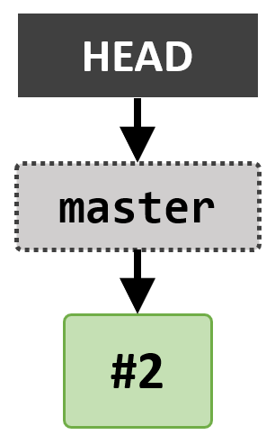
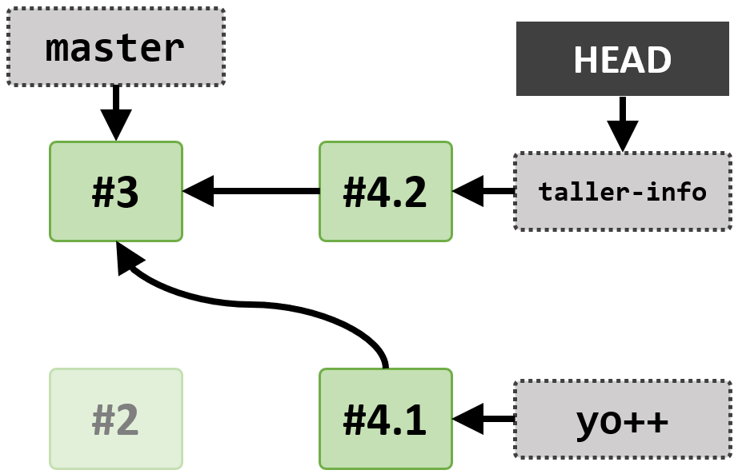
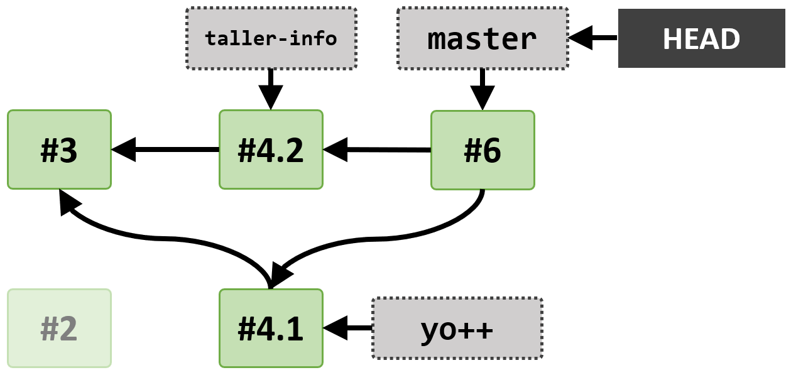
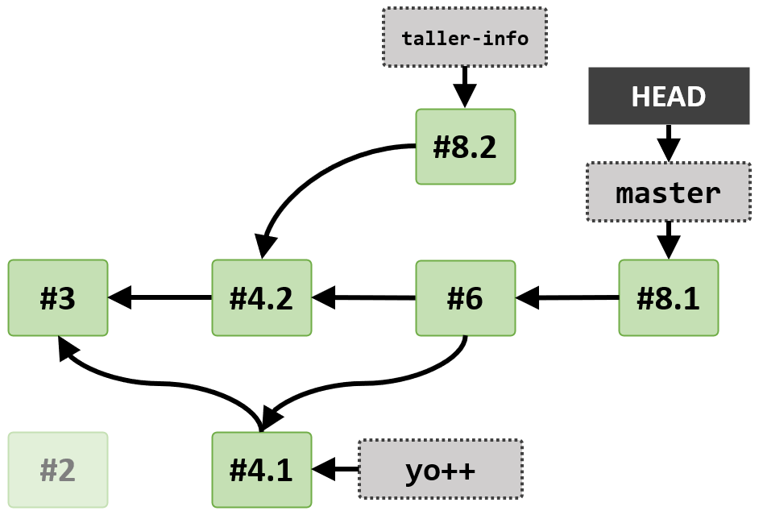
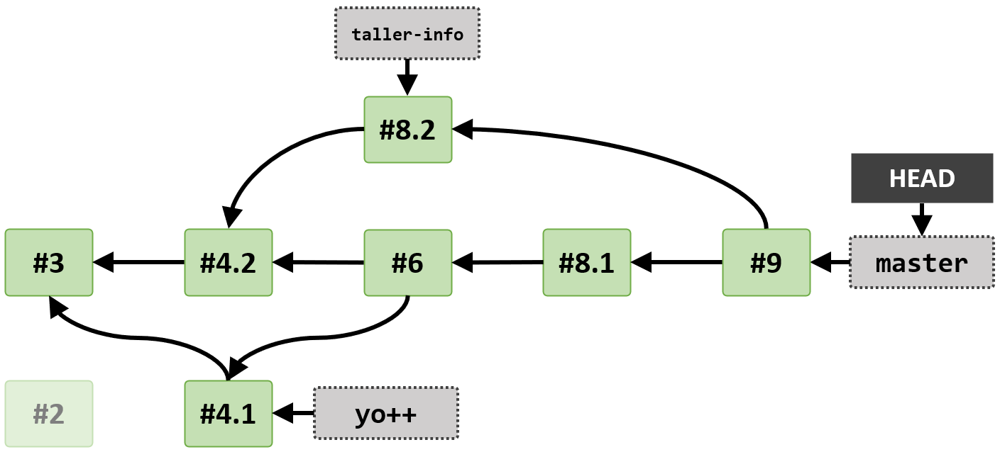

# Introducción a Git y GitHub: Ejercicios

Este repositorio contiene ejercicios para un taller introductorio a Git y GitHub. El taller cubre los contenidos de [Parte 1: Fundamentos, de Manual Definitivo de Git](https://github.com/HerCerM/ManualDefinitivoGit/blob/master/Parte1_Fundamentos.md).

Cada ejercicio que involucra crear un commit contiene una ilustración de cómo debe verse el árbol de commits del repo al final del ejercicio.

**En las ilustraciones, el número dentro de cada commit hace referencia al ejercicio en el que se creó.**

## #1 Configuración inicial

¡**Configura** tu nombre, correo electrónico y editor de texto!

Ejemplo de configuración:

```bash
git config --global user.name "Hernán Cervera"
git config --global user.email hernancervera@example.com
git config --global core.editor nano
```

Tras la configuración puedes ejecutar `git config --global --list` para ver en la terminal toda tu configuración global.

❓ ¿Cómo se llama y dónde se halla el archivo que almacena la configuración global de Git?

## #2 Primer repositorio local

Crea tu primer repositorio en un directorio llamado `git-workshop`.

Crea los archivos `README.md` y `Hernan.txt`. Actualmente los archivos no requieren tener contenido.

Agrega esos dos archivos al staging area y realiza el **primer commit** del repo.

<p align="center">
  
</p>

## #3 Correcciones básicas

¿Tu nombre no es Hernán? Vamos a cambiar el nombre del archivo Hernán.txt para que coincida con el tuyo.

De tal forma que **reescribas** el commit realizado en el paso anterior, renombra el archivo `Hernan.txt` a `<tu-nombre>.txt`, p. ej. `Pablo.txt`.

<p align="center">
  
</p>

## #4 Crear ramas

Crea la rama `yo++` y cámbiate a esa rama. Ahora que estás en la rama `yo++`, escriba una o dos oraciones acerca de ti en el archivo `.txt` con tu nombre.

Cuando hayas concluido de redactar, agrega tus cambios al staging area y realiza un commit.

Ahora regresa al primer commit del repo usando `git checkout master`. Crea otra rama: `taller-info`, y cámbiate a la rama. En el `README.md`, escribe una o dos oraciones acerca del taller, agrega los cambios al staging area y realiza un commit.

<p align="center">
  
</p>


| ℹ | Inspecciona el estado actual del repositorio con: `git log`. Observa que el repo ahora contiene tres commits, uno apuntado por `master`, otro por `taller-info` y el tercero apuntado por `yo++`.
|---|---|

❓ ¿Desde la rama `taller-info`, el archivo `.txt` con tu nombre tiene contenido o está vacío? ¿Por qué crees que es así?

## #5 Merge fast-forward de ramas

Colócate en la rama `master`, e incorpora los cambios de `yo++` a `master` mediante un merge.

## #6 Merge recursive de ramas

Ahora, permaneciendo en `master` incorpora los cambios de `taller-info` en `master` mediante un merge.

<p align="center">
  
</p>

## #7 Navegación absoluta entre commits

Obtén una clara visión del repositorio con el siguiente comando:

```bash
git log --oneline --all --graph
```

Muévete al primer commit del repo utilizando el hash del commit. Ahora regresa el commit más reciente, haciendo checkout a `master`.

## #8 Aparición de conflictos al realizar merge

En `master`, modifica la primera línea del archivo `README.md`, agrega los cambios al staging area y realiza un commit.

Ahora colócate en la rama `taller-info`, modifica la primera línea de `README.md` (de manera distinta a como la modificaste previamente), agrega los cambios al staging area y realiza un commit.

Regresa a `master`, e incorpora los cambios de `taller-info` mediante un merge. Git te debería reportar que ha ocurrido un conflicto que requiere ser solucionado manualmente.

<p align="center">
  
</p>

❓ ¿Por qué ocurrió un conflicto en este caso?


## #9 Resolución de conflictos de merge

En tu editor de texto preferido, abre el archivo con el conflicto (`README.md`), elimina los marcadores de conflicto y edita el contenido de acuerdo a cómo deseas preservar el archivo.

Una vez terminada la edición en el editor de texto, agrega los cambios al staging area y ejecuta `git merge --continue`.

<p align="center">
  
</p>

## #10 Primer repositorio de GitHub

Crea un repositorio público en GitHub, con el nombre de `<tu-nombre>-intro-git`, p. ej. `pablo-intro-git`.

❓ ¿Cómo es GitHub diferente a Git?

## #11 Sube tus cambios a GitHub

Empuja los cambios de tu rama `master` a GitHub, para que los demás también puedan ver tu repo.

❓ Tras realizar push de `master`, ¿puedes también ver en GitHub tus ramas `taller-info` y `yo++`?

## Recursos adicionales

- [Flujos de trabajo con Git](https://github.com/HerCerM/ManualDefinitivoGit/blob/master/Parte2_Profundizando.md#flujos-de-trabajo-workflows). Es importante usar las ramas bajo algún estándar que facilite la colaboración, lectura de la historia y reversión de errores.
- [Cómo redactar mensajes de commit relevantes](https://chris.beams.io/posts/git-commit/). El mensaje de cada commit debe ser conciso y descriptivo acerca de los cambios.
- [Commits atómicos](https://www.freshconsulting.com/atomic-commits/). Es importante seguir ciertas guías para decidir cuándo realizar un commit.
- ⭐ [Parte 2: Profundizando, Manual Definitivo de Git](https://github.com/HerCerM/ManualDefinitivoGit/blob/master/Parte2_Profundizando.md). Para conocer Git a profundidad, abarcando correcciones avanzadas, los peligros de reescribir la historia pública, ignorar archivos y más, vea la segunda parte del manual.
